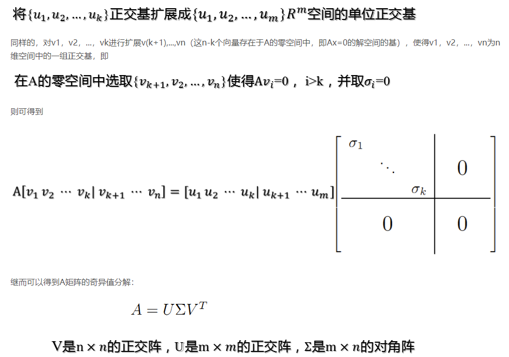

# 数值分析
Timothy Sauer

## 第12章 特征值和奇异值

### 12.3 奇异值分解 SVD
**SVD的核心思想**：
矩阵$A_{m\times n}$可以看做把一组标准正交基$v_1, v_2, \cdots, v_n$转化为另一组标准正交基$u_1, u_2, \cdots, u_m$. 

对任意$M\times N$的矩阵，能否找到一组正交基使得经过它变换后还是正交基？答案是肯定的，它就是SVD分解的精髓所在。

$$
u_i = \frac{1}{\sqrt{\lambda_i}}Av_i
$$
奇异值
$$
\sigma_i=\sqrt{\lambda{_i}}, 0\le i\le k, \\ k = Rank(A)
$$

$\lambda_i$是$A^TA$的特征值，也是$AA^T$的特征值

