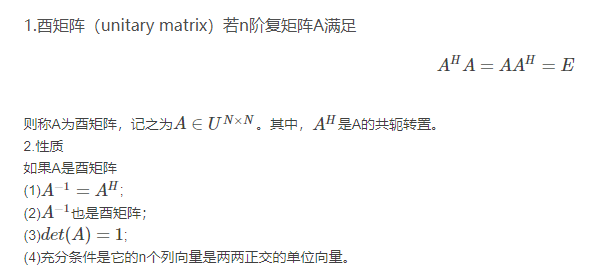
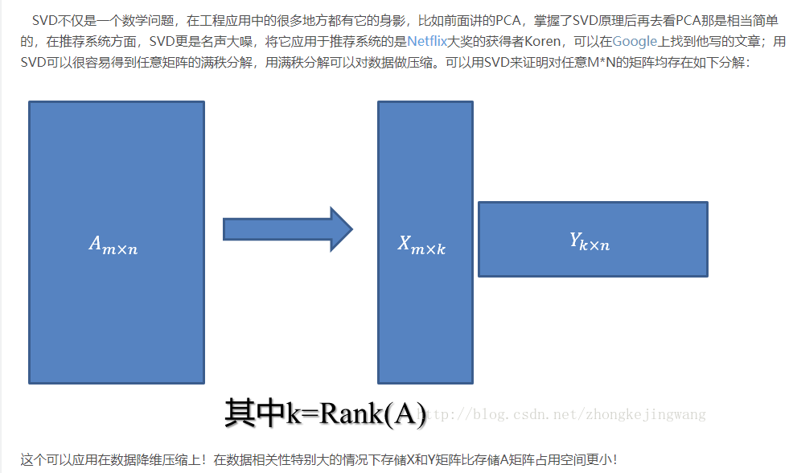
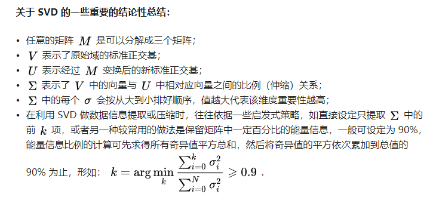
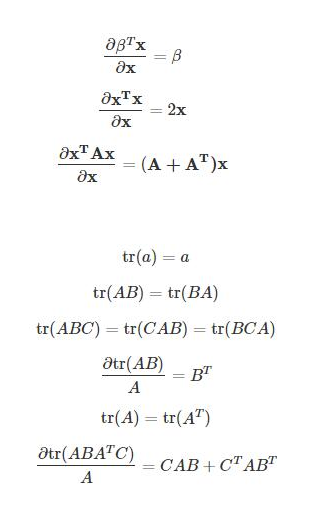

# Deep Learning 深度学习

Ian Goodfellow, Yoshua Bengio, Aaron Courville

##Part I Applied Math and Machine Learning Basics

### Chapter 2 Linear Algebra
#### 2.1 Scalars, Vectors, Matrices and Tensors
* **主对角线(main diagonal)**: 从左上角到右下角的对角线
* **broadcasting**:
$$C = A + b$$
其中$$C_{i, j} = A_{i, j} + b_j$$

#### 2.2 Multiplying Matrices and Vectors
* **矩阵乘积**: $C = AB$
* **Hadamard乘积(Hadamard-Product)**: 元素对应乘积
* 两个向量的点积满足交换律:
$$x^Ty=y^Tx$$

#### 2.3 Identity and Inverse Matrices 单位矩阵和逆矩阵
**LU分解**:矩阵求逆的高效算法

#### 2.4 Linear Dependence and Span 线性相关和生成子空间

#### 2.5 Norms 范数
* **范数(norm)**: 衡量向量的大小
* **$L^p范数$**:
$$
||x_p||=(\sum_{i}|x_i|^p)^\frac{1}{p}
$$

* $L^2$范数对每个元素求导和整个向量相关
* 平方$L^2$范数对$x$求导只取决于对应的元素， 但是其求导在原点处增长十分缓慢
* $L^1$范数在各个位置斜率相同
* $L^1$范数经常作为表示非零元素数目的替代函数？
* **$L^{\infty}$范数**: 最大范数(max norm)
$$
||x||_{\infty} = \max_{i}|x_i|
$$

* **Frobenius范数**: 衡量矩阵的大小
$$
||A||_F = \sqrt{\sum_{i, j}A_{i, j}^2}
$$

#### 2.6 Special Kinds of Matrices and Vectors

* 正交矩阵是在欧几里得空间里的叫法，在酉空间里叫**酉矩阵**，一个正交矩阵对应的变换叫正交变换，这个变换的特点是不改变向量的尺寸和向量间的夹角

#### 2.7 EigenDecomposition 特征分解
$$
Av = \lambda v
$$
$$
A = Vdiag(\lambda)V^{-1}
$$

#### 2.8 Singular Value Decomposition (SVD)

$$
A_{m\times n} = U_{m\times m}D_{m\times n}V_{n\times n}^T
$$
**$U, V$都是正交矩阵, $D$是对角阵**

* **A的奇异值**: 对角矩阵$D$的对角线上的元素
* **左奇异向量**: $U$的列向量
* **右奇异向量**: $V$的列向量

A 的 左奇异向量（left singular vector）是 $AA^T$的特征向量。 A 的 右奇异向量（right singular vector）是 $A^TA$ 的特征向量。 A 的非零奇异值是 $A^TA$  特征值的平方根，同时也是$AA^T$  特征值的平方根。

#### 2.9 The Moore-Penrose Pseudoinverse -- Moore-Penrose伪逆

#### 2.10 The Trace Operator 迹运算
迹运算返回的是矩阵对角元素的和
$$
Tr(A) = \sum_{i}A_{i, i}
$$
Frobenius范数
$$
||A||_F = \sqrt{Tr(AA^T)}
$$

性质
* $Tr(A^T) = Tr(A)$
* $Tr(AB) = Tr(BA)$

#### 2.11 The Determinant 行列式
* 行列式，记作$det(A)$，是一个将方阵 $A$ 映射到实数的函数。
* 行列式等于矩阵特征值的乘积。
* 行列式的绝对值可以用来衡量矩阵参与矩阵乘法后空间扩大或者缩小了多少。如果行列式是 0，那么空间至少沿着某一维完全收缩了，使其失去了所有的体积。如果行列式是 1，那么这个转换保持空间体积不变。

#### 2.12 Example: Principal Components Analysis （PCA， 主成分分析）
PCA...不就是SVD吗 -- **数学上等价**

* 方差最大
* 均方误差最小

## Appendix
### 常用公式

